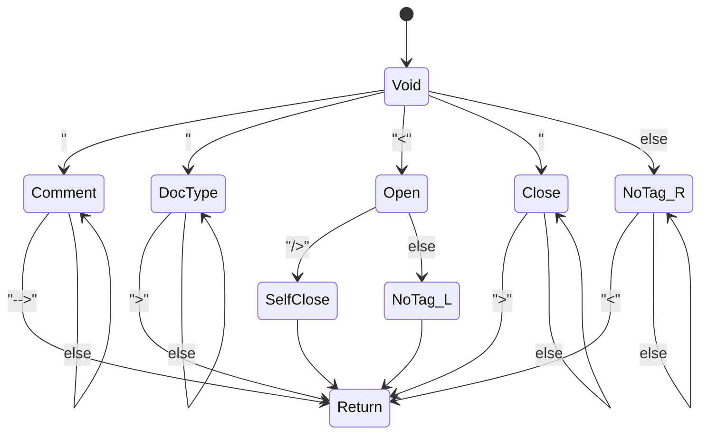

### Lexer `GetNextToken` state diagram

```mermaid
stateDiagram-v2
    [*] --> Void

    Void --> Comment : "<!--"
    Comment --> Return : "-->"
    Comment --> Comment : else

    Void --> DocType : "<!DOCTYPE"
    DocType --> Return : ">"
    DocType --> DocType : else

    Void --> Open : "<"
    Open --> SelfClose : "/>"
    Open --> NoTag_L : else
    SelfClose --> Return

    Void --> Close : "</"
    Close --> Return : ">"
    Close --> Close : else

    Void --> NoTag_R : else
    NoTag_R --> Return : "<"
    NoTag_R --> NoTag_R : else

    NoTag_L --> Return

    state Return <<final>>
```
